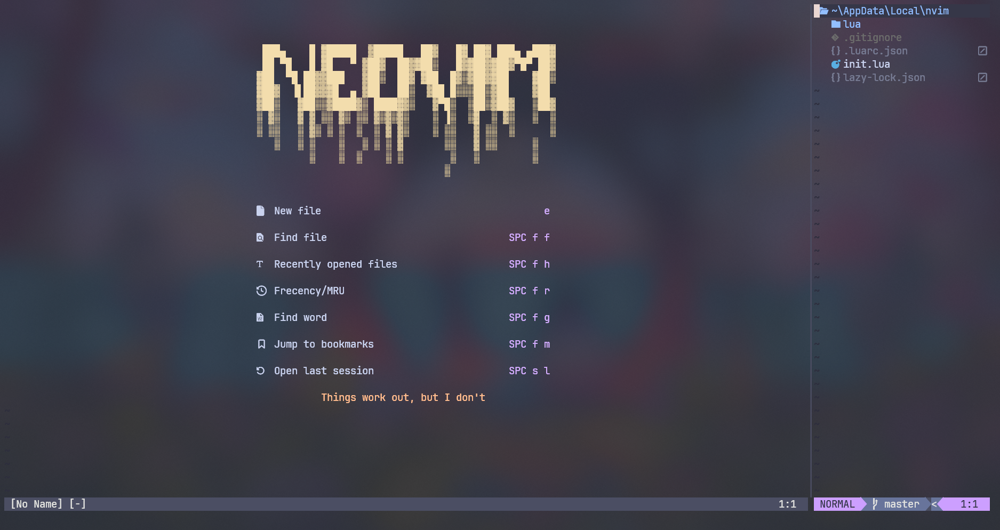

# RajeshJaga/nvim

This is my configuration of neovim for daily usage text-editor.

### Lsp

This configuration should support major languages LSP (rust, c, js, ts, css, html, python, tailwindcss, lua, go, bash, sh)

If any language lsp is missing, try install using mason
- `:MasonInstall bash-language-server` : for bash lsp

If unsure of what to install, try going through mason's list of lsp, dap, linter, formatter
- `:Mason` should open a pop-up to show the lists of plugins to install

### Colorscheme

I love catppuccin-mocha with transaparenct, looks exactly like above screenshot (note: acrylic background was made witrh windows terminal)

To change the colorscheme try changing the `lua/lucifer/colorscheme.lua`

### Autocomplete

Langauages with lsp support should have autosuggestion/auto-complete enabled by default.

### Side Explorer

We can access the project files using neotree.nvim(use Ctrl-n).

### Keychords hint

Added `which-key.nvim` to display hints on the key chords/binds.

### Miscellaneous

- tabstop, shiftwidth, softabstop is taken care by `vim-sleuth`
- try `:VimBeGood` to practice the key binds
- there is indentline to show the scriptblock
- harpoon to access files blazingly fast
- to comment/uncomment  highlight and then `gc`
- to manually format current buffer try `leader + f`
- auto closing tags(html,jsx,tsx)
- use leader + c to enable color preview in the buffer
- use jj to exit the insert mode
- use tt to exit a terminal insert mode
- install nodejs, then `npm i -g neovim tree-sitter-cli` to install treesitter, add lsp support.
- install python, then `pip install neovim`, on linux `sudo pacman -S python-neovim` for python support
- install gcc/zig, ripgrep, tar/unzip, wget/curl, luarocks on windows or linux
